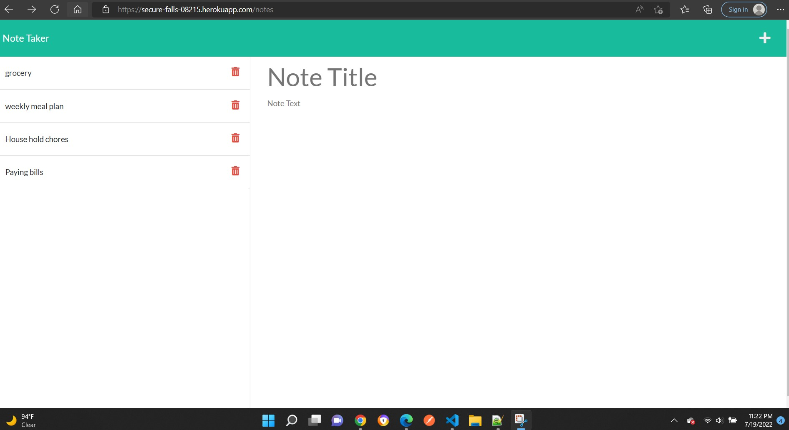

1. Created folder structure and pushed the code to unique repo "Note_taker" https://github.com/ashwinilh/Note_taker
2. Hosted  on heroku with the URL- https://secure-falls-08215.herokuapp.com/
3. This repo is for challenge 11 of UT boot camp to create an app called note taker that can be used to write and save notes.
4. Downloaded starter code
5. Created folder structure
6. Installed dependencies: express npm package
7. Created express sever. Corrected path to index.js file and style.css file.
8. Added notes request and post request.Added id note while posting.
9. Added uuid npm package for unique id
10. REmoved fs parameter from api routes
11. Added delete request and updated get and post requests.